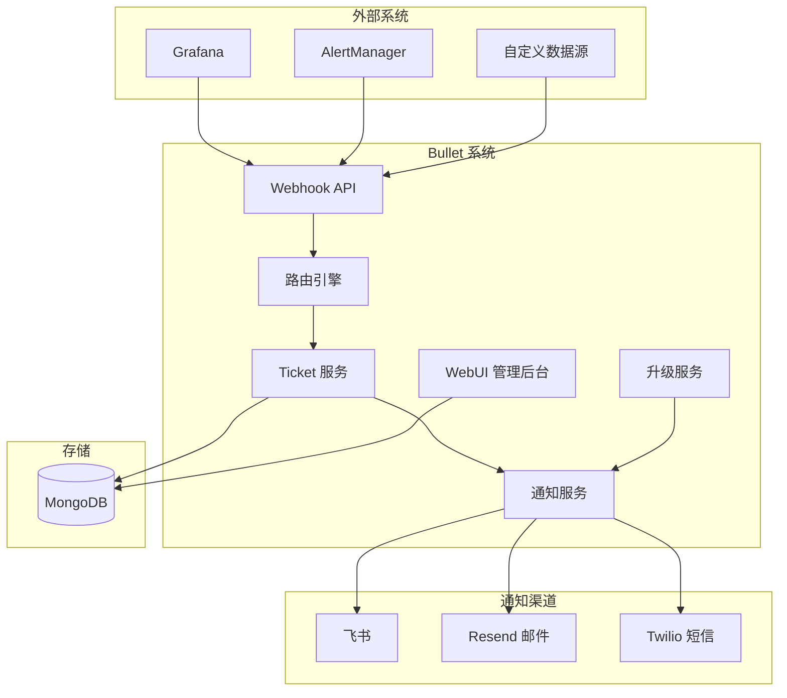
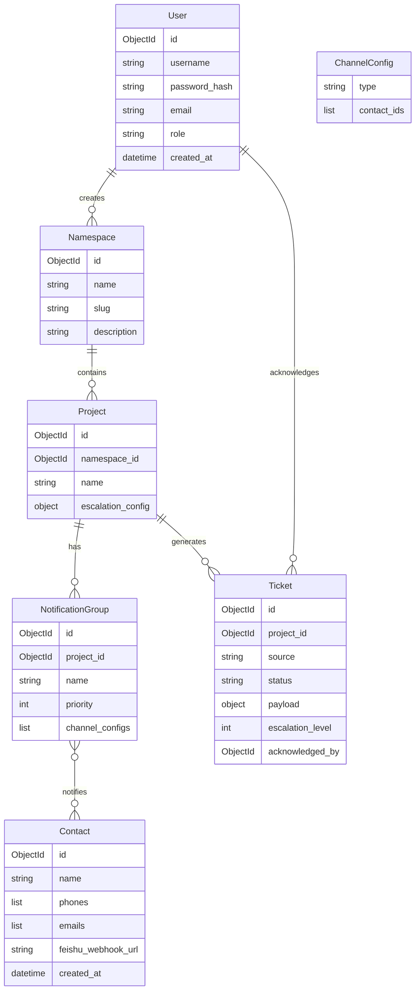

# Bullet WebUI 重构计划

## 架构概览



## 数据模型设计



## 技术栈

| 层级 | 技术 |

|------|------|

| 后端框架 | FastAPI |

| 数据库 | MongoDB + Beanie ODM |

| 模板引擎 | Jinja2 |

| 前端交互 | htmx + Alpine.js |

| 样式 | Tailwind CSS |

| 前端构建 | pnpm |

| 认证 | Session-based (cookie) |

## 代码架构风格

参考 [devpush](https://github.com/hunvreus/devpush/) 项目的代码组织方式：

### FastAPI Depends 模式

```python
# app/deps.py - 依赖注入
from fastapi import Depends, HTTPException, Request
from app.models.user import User

async def get_db():
    """获取数据库会话"""
    # Beanie 已在 lifespan 中初始化，直接使用即可
    yield

async def get_current_user(request: Request) -> User:
    """从 session cookie 获取当前用户"""
    user_id = request.session.get("user_id")
    if not user_id:
        raise HTTPException(status_code=401, detail="Not authenticated")
    user = await User.get(user_id)
    if not user:
        raise HTTPException(status_code=401, detail="User not found")
    return user

async def require_admin(user: User = Depends(get_current_user)) -> User:
    """要求管理员权限"""
    if user.role != "admin":
        raise HTTPException(status_code=403, detail="Admin required")
    return user
```

### 路由使用示例

```python
# app/web/users.py
from fastapi import APIRouter, Depends
from app.deps import get_current_user, require_admin
from app.models.user import User

router = APIRouter(prefix="/users", tags=["users"])

@router.get("/")
async def list_users(admin: User = Depends(require_admin)):
    """列出所有用户（仅管理员）"""
    users = await User.find_all().to_list()
    return templates.TemplateResponse("users/list.html", {"users": users})

@router.get("/me")
async def get_me(user: User = Depends(get_current_user)):
    """获取当前用户信息"""
    return templates.TemplateResponse("users/profile.html", {"user": user})
```

### 服务层模式

```python
# app/services/notification.py
class NotificationService:
    @staticmethod
    async def send_to_group(ticket: Ticket, group: NotificationGroup):
        """发送通知到指定通知组"""
        for channel_config in group.channel_configs:
            contacts = await Contact.find({"_id": {"$in": channel_config.contact_ids}}).to_list()
            channel = ChannelFactory.create(channel_config.type)
            await channel.send(ticket, contacts)
```

## 前端 UI 风格

**传统、朴素、实用为主**：

- **圆角**：使用 `rounded-sm` 或 `rounded-none`，避免大圆角
- **动画**：仅在必要的反馈场景使用（如按钮点击、加载状态），不做装饰性动画
- **配色**：中性色为主（灰色系），信息用蓝色、成功用绿色、警告用黄色、错误用红色
- **间距**：紧凑但不拥挤，`p-2`、`p-3` 为主
- **边框**：使用清晰的边框分隔区域，`border border-gray-300`
- **表格**：传统表格样式，带边框和斑马纹
- **表单**：标准输入框样式，无浮动标签等花哨效果

### Tailwind 配置示例

```javascript
// tailwind.config.js
module.exports = {
  theme: {
    extend: {
      borderRadius: {
        DEFAULT: '2px',  // 默认小圆角
      },
    },
  },
}
```

### 组件风格示例

```html
<!-- 按钮：朴素风格 -->
<button class="px-3 py-1.5 bg-blue-600 text-white text-sm rounded-sm hover:bg-blue-700 border border-blue-700">
  保存
</button>

<!-- 表格：传统带边框 -->
<table class="w-full border-collapse border border-gray-300 text-sm">
  <thead class="bg-gray-100">
    <tr>
      <th class="border border-gray-300 px-3 py-2 text-left">名称</th>
      <th class="border border-gray-300 px-3 py-2 text-left">状态</th>
    </tr>
  </thead>
  <tbody>
    <tr class="hover:bg-gray-50">
      <td class="border border-gray-300 px-3 py-2">项目A</td>
      <td class="border border-gray-300 px-3 py-2">运行中</td>
    </tr>
  </tbody>
</table>

<!-- 卡片：方正风格 -->
<div class="border border-gray-300 bg-white p-4 rounded-sm shadow-sm">
  <h3 class="text-base font-medium mb-2">标题</h3>
  <p class="text-sm text-gray-600">内容</p>
</div>
```

## 目录结构

```javascript
app/
├── main.py                     # 入口，挂载路由
├── config.py                   # 配置（含 MongoDB URI）
├── database.py                 # MongoDB 连接初始化
├── auth/                       # 认证模块
├── models/                     # Beanie Document 模型
│   ├── user.py
│   ├── contact.py
│   ├── namespace.py
│   ├── project.py
│   ├── notification_group.py
│   └── ticket.py
├── api/                        # API 路由（webhook、确认回调）
├── web/                        # WebUI 路由（htmx 页面）
├── services/                   # 业务逻辑
│   ├── router.py               # 基于 DB 的路由
│   ├── notification.py         # 通知发送
│   └── escalation.py           # 升级调度（后台任务）
├── channels/                   # 通知渠道实现
│   ├── feishu.py
│   ├── resend_email.py
│   └── twilio_sms.py
├── sources/                    # 数据源解析器
├── templates/                  # Jinja2 模板
└── static/                     # 静态资源
frontend/
├── package.json                # pnpm 依赖
├── tailwind.config.js
└── src/
    └── input.css               # Tailwind 入口
```

## 核心功能模块

### 1. 用户认证系统

- 初始管理员账户（首次启动时通过环境变量创建）
- Session-based 认证，使用 `itsdangerous` 签名 cookie
- 角色：`admin`（可管理用户）、`user`（普通操作）

### 2. 联系人管理（号码簿）

- 独立的联系人记录，不关联系统用户
- 字段：姓名、手机号列表、邮箱列表、飞书 Webhook Bot URL
- 在通知组配置时可选择联系人

### 3. Namespace 和项目管理

- Namespace 作为项目的分组容器，有唯一 slug 用于 URL
- Webhook URL 格式：`/webhook/{namespace_slug}/{project_id}?source=grafana`

### 4. 通知组和升级策略

- 每个项目可配置多个通知组，按 priority 排序
- 升级配置：`max_unacked_count`（N次无人处理后升级）、`escalation_timeout_minutes`（N分钟后升级）
- 后台任务定时检查未确认 Ticket，触发升级

### 5. Ticket 系统

- 每次 Webhook 调用创建一个 Ticket
- 状态：`pending` → `acknowledged` / `escalated` → `resolved`
- 支持按项目、状态、时间范围搜索
- 确认方式：WebUI 点击确认 / 通知中的回调链接

### 6. 通知渠道

- 保留现有飞书、Resend 邮件渠道
- 新增 Twilio 短信渠道
- 通知模板支持渲染确认回调 URL

## 关键文件变更

| 文件 | 变更 ||------|------|| [pyproject.toml](pyproject.toml) | 添加 `beanie`, `motor`, `itsdangerous`, `apscheduler` 依赖 || [app/config.py](app/config.py) | 添加 MongoDB URI、初始管理员、Session 密钥配置 || [app/router.py](app/router.py) | 重构为从 MongoDB 读取路由规则 || `app/database.py` | 新建，MongoDB 连接和 Beanie 初始化 || `app/models/*.py` | 新建 Beanie Document 模型 || `app/services/escalation.py` | 新建，升级策略后台任务 || `app/channels/twilio_sms.py` | 新建，Twilio 短信渠道 || `frontend/` | 新建，pnpm + Tailwind 构建配置 |